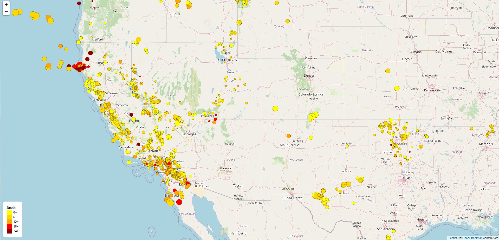

# Leaflet-USGS-Data-Visualization
## The United States Geological Survey, or USGS for short, is responsible for providing scientific data about natural hazards, the health of our ecosystems and environment, and the impacts of climate and land-use change. This tool was built to visualize their earthquake data and displaying it in a meaningful way using Leaflet.
## JSON file "https://earthquake.usgs.gov/earthquakes/feed/v1.0/summary/all_month.geojson" was used to pull 30 days of earthquake data.
## The file "index.html" provides the framework, and uses javascript file "static/css/logic.js" and css file "static/css/style.css".
### Leaflet was used to create a map that plots all the earthquakes from the 30-day dataset based on their longitude and latitude.
### Data markers reflect the magnitude of the earthquake by their size and the depth of the earthquake by color. Earthquakes with higher magnitudes appear larger, and earthquakes with greater depth appear darker in color.
### Popups provide additional information about the earthquake when its associated marker is clicked.
### A legend provides context for the map color data.
### The displayed area chosen for this map focuses on the earthquake-rich western half of the United States.
### Livev view can be found at: https://mark-lech.com/Leaflet-USGS-Data-Visualization/

